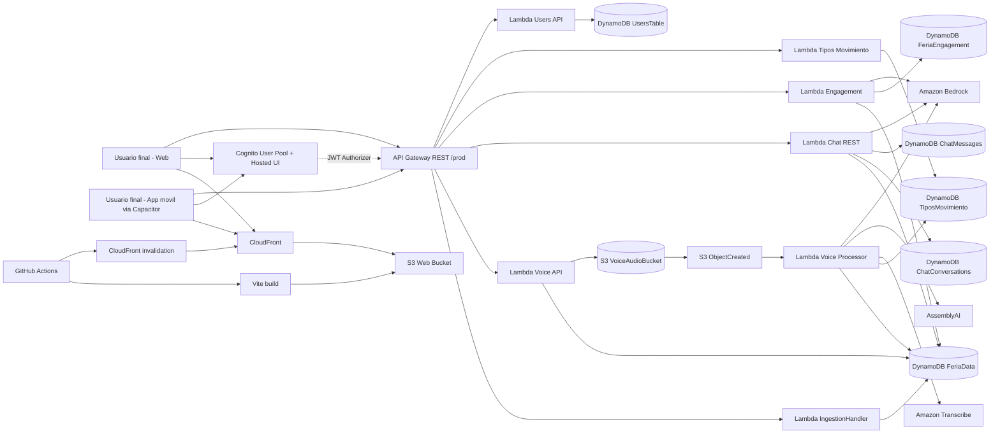

# Arquitectura y Modelo B2B2C (Feria)

Feria es una plataforma de educación y acompañamiento financiero. El proyecto está dividido en dos repos para agilizar el desarrollo:
- `feria`: Frontend, experiencia de usuario y conexión a APIs.
- `feria-infraestructure`: Backend, AWS CDK, Lambdas y base de datos.

## Tech Stack

### Frontend
- **Framework**: Ionic React 8, React 19, React Router 5
- **Build Tool**: Vite 5 con TypeScript
- **Movilidad**: Capacitor 8
- **Autenticación**: AWS Amplify (Cognito Hosted UI)
- **Testing**: Vitest, React Testing Library, Cypress

### Backend e IA
- **API**: Amazon API Gateway REST
- **Compute**: AWS Lambda (Node.js 20)
- **Base de Datos**: DynamoDB (on-demand)
- **Storage**: Amazon S3
- **IA y Voz**: Amazon Bedrock (Tutor/Clasificador), Amazon Transcribe / AssemblyAI

### Infraestructura
- **IaC**: AWS CDK v2 (TypeScript)
- **CI/CD**: GitHub Actions desplegando a S3 + CloudFront

## Diagrama de Despliegue

## Modelo B2B2C

- **Usuario final (C)**: Personas que buscan mejorar su salud financiera mediante registro de gastos, tutor de IA y retos.
- **Cliente (B)**: Empresas (neobancos, fintechs, programas de bienestar) que distribuyen la herramienta a sus usuarios.

La idea es que los usuarios obtienen claridad y motivación. Las empresas consiguen un canal de engagement recurrente y datos agregados sobre cómo sus usuarios interactúan con la plataforma. De esta manera el valor core no depende de anuncios invasivos.

## Decisiones de Arquitectura

- Elegimos **Ionic + React + Capacitor** para mantener una sola base de código en web y móvil. Esto nos dio mucha velocidad de iteración.
- Delegar el login a **Cognito + Amplify** fue clave para ahorrarnos temas de seguridad e implementar flujos de OAuth rápidamente.
- La capa serverless (API Gateway + Lambdas + DynamoDB on-demand) mantiene los costos prácticamente en cero durante el desarrollo y absorbe picos de tráfico de manera natural.
- Todo lo que es procesamiento de voz corre de fondo (**event-driven**). El usuario sube el audio a S3 (mediante pre-signed URLs) y un evento levanta un Lambda para transcribir y clasificar el gasto sin bloquear la UI.
- Finalmente, exponer el dashboard via S3 + CloudFront garantiza un SLA excelente y distribución por CDN automatizada mediante Actions.

## Trabajo Pendiente / Próximos Pasos

- Habilitar un entorno formal `staging`.
- Limpiar políticas IAM y sacar secretos como variables del proyecto a algo nativo como Secrets Manager o System Manager.
- Definir un modo offline-first para guardar gastos cuando no hay red y sincronizarlos después.

## Alineación con ODS 8

Nuestro foco está en reducir el estrés financiero para construir ambientes de trabajo y vidas más sanas. Promovemos el **Trabajo decente y crecimiento económico** aportando herramientas claras a personas de distinto nivel de alfabetización financiera, priorizando SIEMPRE la privacidad e intimidad de sus transacciones. No se venden los datos individuales.