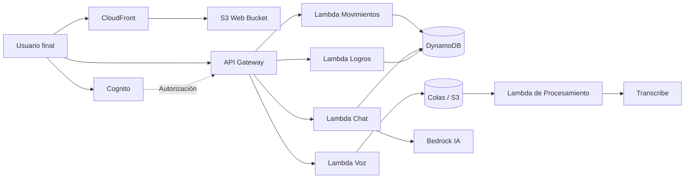

# Arquitectura y Modelo (Feria)

Feria es una plataforma de educación y acompañamiento financiero. Separamos el proyecto en dos repositorios para no pisarnos durante el desarrollo:
- `feria`: Donde vive todo el frontend web y app móvil.
- `feria-infraestructure`: Todo el backend en AWS (base de datos, Lambdas, IA).

## Tech Stack

### Frontend
- **Framework**: Ionic React 8, React 19.
- **Build**: Vite 5 con TypeScript.
- **App móvil**: Capacitor 8.
- **Autenticación**: AWS Amplify con Cognito Hosted UI.

### Backend e IA
- **API**: Amazon API Gateway REST.
- **Código Serverless**: AWS Lambda (Node.js 20).
- **Base de Datos**: DynamoDB (tablas en modo on-demand).
- **Archivos**: Amazon S3.
- **IA**: Amazon Bedrock para el tutor conversacional y Amazon Transcribe para procesar los audios de los gastos.

### DevOps e Infraestructura
- **IaC**: AWS CDK v2 para tener toda la infraestructura como código usando TypeScript.
- **CI/CD**: GitHub Actions desplegando hacia nuestro S3 + CloudFront.

## Diagrama Funcional

## Decisiones Técnicas

Elegimos usar Ionic + React con Capacitor porque nos dejaba mantener una base de código central y probar rápido tanto en la web como en el celular. Al delegarle todo el manejo de usuarios a AWS Cognito nos saltamos el dolor de cabeza de tener que armar esquemas de contraseñas y flujos de reseteo, lo cual nos ahorró un montón de tiempo valioso en el hackathon.

Por el lado del backend fuimos completamente por Serverless. Cuesta casi cero mientras programamos y escala solo si hay pico de uso. Todo el trabajo pesado de IA (como la API que te transcribe un gasto que dictaste por voz) se ejecuta "de fondo" reaccionando a un evento almacenado en S3, garantizando que el usuario jamás se quede viendo una pantalla de carga congelada.

## Tareas Pendientes

- Mover un par de secretos al Parameter Store de AWS.
- Idear un flujo offline: poder abrir la app, tocar "Registrar", que se guarde un borrador en la memoria del celular y se suba a la nube cuando estemos devuelta con Wi-Fi o datos.